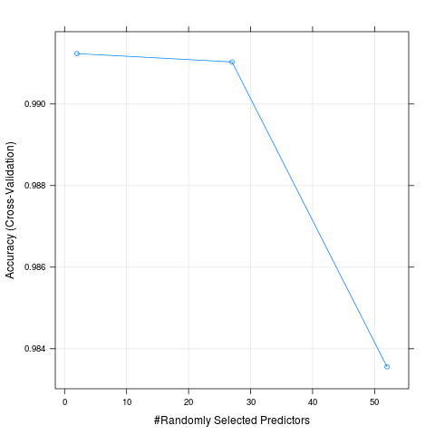
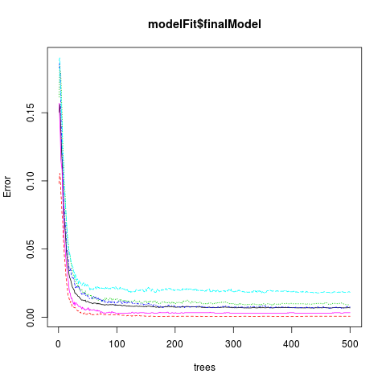

# Practical Machine Learning Course Project

## Overview

Using devices such as Jawbone Up, Nike FuelBand, and Fitbit it is now possible to collect a large amount of data about personal activity relatively inexpensively. One thing that people regularly do is quantify how much of a particular activity they do, but they rarely quantify how well they do it. In this project, we use data from accelerometers on the belt, forearm, arm, and dumbell of 6 participants. They were asked to perform barbell lifts correctly and incorrectly in 5 different ways. The goal of the project is to predict the manner in which they did the exercise.

The data for this project come from this source: http://groupware.les.inf.puc-rio.br/har.

## Approach

Steps to create a model to predict the manner in which exercises are performed:

1. Load the training and test data
2. Clean up both datasets
3. Partition the training set into training and test data
4. Set up the ability to use multiple CPU’s to speed up the model creation step
5. Train a model using random forest (explanation why random forest below)
6. Apply against test data set created from the original training set (step 3)
7. Estimate Out of Sample Error
8. Apply the model against the original test data with unknown outcomes to determine the manner in which each exercise was performed
9. Write the outcomes to a file for upload for assessment

## R Environment Setup

```{r setup, cache = F, echo = F, message = F, warning = F, tidy = F}
install.packages(“caret”,dependencies=TRUE)
install.packages(“randomForest”,dependencies=TRUE)
install.packages(“doParallel”,dependencies=TRUE)
library(caret)
library(randomForest)
library(doParallel)
```

## Loading and Cleaning the Datasets

I downloaded the datasets manually from the Assignment Writeup page, then proceeded to load and clean the data:

### Load and initial clean

Load both the training and testing data, cleaning up any NA, empty or divide by zero error strings using ‘na.strings’ option of read.csv.

```{r setup, cache = F, echo = F, message = F, warning = F, tidy = F}
pmlTraining = read.csv("../pml_course/pml-training.csv", na.strings = c("NA","","#DIV/0!"))
pmlTesting = read.csv("../pml_course/pml-testing.csv", na.strings = c("NA","","#DIV/0!"))
```

This results in the following data sets:

```{r setup, cache = F, echo = F, message = F, warning = F, tidy = F}
> dim(pmlTraining)
[1] 19622   160
> dim(pmlTesting)
[1]  20 160
```

### Remove NA and Unnecessary Data

The next step is to remove data not useful to in our training step, this includes incomplete data, columns with NA’s in this case, and columns we won’t be using to train the data, in this case columns 1 through 7 i.e. columns named X, user_name, raw_timestamp_part_1, raw_timestamp_part_2, cvtd_timestamp, new_window, and num_window. We remove these as we need only focus in on the raw sensor data related to movement, and time related data is not important in this model since the movement, good or bad can happen at any time.
Start with the training data
```{r setup, cache = F, echo = F, message = F, warning = F, tidy = F}
training <- pmlTraining[,colSums(is.na(pmlTraining)) == 0][,-c(1:7)]
```

Match and remove the same columns from the test data

```{r setup, cache = F, echo = F, message = F, warning = F, tidy = F}
colUsed <- colnames(pmlTraining[,colSums(is.na(pmlTraining)) == 0])[-(1:7)]
testingData <- pmlTesting[colUsed[colUsed!='classe']]
```

This results in the following data that has just the outcome variable (in the training set only) and potential predictors:

```{r setup, cache = F, echo = F, message = F, warning = F, tidy = F}
> dim(training)
[1] 19622    53
> dim(testingData)
[1] 20 52 # We have 52 because classe is not included, this is the outcome we are wanting to predict
```

## Partition the training set into a training and test set

We partition on the classe variable, and in the case use a 75/25 split for training/test data

```{r setup, cache = F, echo = F, message = F, warning = F, tidy = F}
inTrain <- createDataPartition(training$classe,p=0.75,list=FALSE)
trainData <- training[inTrain,]
testData <- training[-inTrain,]
```

This gives us the following data partitions:

```{r setup, cache = F, echo = F, message = F, warning = F, tidy = F}
> dim(trainData)
[1] 14718    53
> dim(testData)
[1] 4904   53
```

## Set up parallel/multicore processing

Although I ran this on an i7 2.00 GHz 8 core CPU with 16 GB RAM, I had memory allocation issues trying it with more than 4 cores allocated to the processing. Here are the settings I used:

```{r setup, cache = F, echo = F, message = F, warning = F, tidy = F}
cl <- makeCluster(4)
registerDoParallel(cl)
```

## Train model using Random Forest

I’m using the random forest method as it works well on a large number of variables (we have 52), and there is no need for applying principal component analysis (pca) to reduce the number of predictors, this is implicit in its method, it randomly finds the best fitting predictors. Random forest can lead to overfitting without cross validation. Here we use cross validation with resampling, to produce a low variance but still get good bias.

```{r setup, cache = F, echo = F, message = F, warning = F, tidy = F}
modelFit <- train(classe ~ .,data=trainData,method="rf",trControl=trainControl(method="cv",number=5,allowParallel=TRUE),prox=TRUE)
```

This produces the model below. You can see that it used the 52 predictors, and found 5 factors in the classe variable, A,B,C,D and E. It also used resampling 5 times with cross-validation.

Interestingly enough the final mtry was 2 out of the 52 possible predictors. The plot below (the Model Fit figure) output shows this nicely, with the highest accuracy point being at 2 predictors. I did multiple runs on the training data, this being the last. I notice that sometimes it was not 2, but 27 predictors had the highest accuracy. This shows the variability/randomness in the model training (at least without a seed set).

Also the finalModel has 500 trees, although you can see from the plot below (the Final Model figure) that after about 100 trees the error doesn’t change much across all classes.

```{r setup, cache = F, echo = F, message = F, warning = F, tidy = F}
> modelFit
Random Forest 

14718 samples
   52 predictors
    5 classes: 'A', 'B', 'C', 'D', 'E' 

No pre-processing
Resampling: Cross-Validated (5 fold) 

Summary of sample sizes: 11773, 11774, 11774, 11776, 11775 

Resampling results across tuning parameters:

  mtry  Accuracy   Kappa      Accuracy SD   Kappa SD   
   2    0.9912352  0.9889115  0.0009117093  0.001153311
  27    0.9910312  0.9886546  0.0013519706  0.001709911
  52    0.9835563  0.9791973  0.0051781388  0.006551089

Accuracy was used to select the optimal model using  the largest value.
The final value used for the model was mtry = 2.
```

### ModelFit Figure


```{r setup, cache = F, echo = F, message = F, warning = F, tidy = F}
> modelFit$finalModel

Call:
 randomForest(x = x, y = y, mtry = param$mtry, proximity = TRUE) 
               Type of random forest: classification
                     Number of trees: 500
No. of variables tried at each split: 2

        OOB estimate of  error rate: 0.69%
Confusion matrix:
     A    B    C    D    E  class.error
A 4182    2    0    0    1 0.0007168459
B   19 2822    7    0    0 0.0091292135
C    0   17 2548    2    0 0.0074016362
D    0    0   41 2368    3 0.0182421227
E    0    0    2    7 2697 0.0033259424
```

### Final Model Figure


## Apply model to the original training set test data (step 3)

Applying this to our created test set (not the given test set), we can see how well our model performs. Below from the confusionMatrix you can see that we estimate a high level of accuracy, 99.55%.

```{r setup, cache = F, echo = F, message = F, warning = F, tidy = F}
testPred <- predict(modelFit,newdata=testData)

> confusionMatrix(testPred,testData$classe)
Confusion Matrix and Statistics

          Reference
Prediction    A    B    C    D    E
         A 1392    3    0    0    0
         B    1  946    8    0    0
         C    2    0  847    7    0
         D    0    0    0  797    1
         E    0    0    0    0  900

Overall Statistics
                                          
               Accuracy : 0.9955          
                 95% CI : (0.9932, 0.9972)
    No Information Rate : 0.2845          
    P-Value [Acc > NIR] : < 2.2e-16       
                                          
                  Kappa : 0.9943          
 Mcnemar's Test P-Value : NA              

Statistics by Class:

                     Class: A Class: B Class: C Class: D Class: E
Sensitivity            0.9978   0.9968   0.9906   0.9913   0.9989
Specificity            0.9991   0.9977   0.9978   0.9998   1.0000
Pos Pred Value         0.9978   0.9906   0.9895   0.9987   1.0000
Neg Pred Value         0.9991   0.9992   0.9980   0.9983   0.9998
Prevalence             0.2845   0.1935   0.1743   0.1639   0.1837
Detection Rate         0.2838   0.1929   0.1727   0.1625   0.1835
Detection Prevalence   0.2845   0.1947   0.1746   0.1627   0.1835
Balanced Accuracy      0.9985   0.9973   0.9942   0.9955   0.9994
```

## Estimate Out of Sample Error

To verify what the confusionMatrix output is telling us about the estimated accuracy and out of sample error, we calculate the accuracy ourselves, (correct answers/number of rows), then invert that to get the estimate of the Out of Sample Error.

```{r setup, cache = F, echo = F, message = F, warning = F, tidy = F}
> (1 - sum(testPred == testData$classe)/length(testPred)) * 100
[1] 0.4486134
```

So the estimated Out of Sample Error for the above model is:

0.45%

which coincides with what the confusionMatrix is telling us i.e. (1 - 0.9955) * 100 = 0.45%

## Apply model to test data to determine outcomes

Now we can apply our model to the given test data, the data we want to determine outcomes for.

```{r setup, cache = F, echo = F, message = F, warning = F, tidy = F}
answers <- predict(modelFit,newdata=testingData)
```

This gives us a list of outcomes for each of the 20 test rows with one value for each test row that is one of A,B,C,D or E.

## Write the outcomes to a file for upload and assessment

To upload the answers to be assessed, I’m using the code given on the Coursera website:

```{r setup, cache = F, echo = F, message = F, warning = F, tidy = F}
pml_write_files = function(x){
  n = length(x)
  for(i in 1:n){
    filename = paste0("problem_id_",i,".txt")
    write.table(x[i],file=filename,quote=FALSE,row.names=FALSE,col.names=FALSE)
  }
}

pml_write_files(answers)
```

This produces 20 files called problem_id_1.txt through problem_id_20.txt, each with one of A,B,C,D or E in them.
